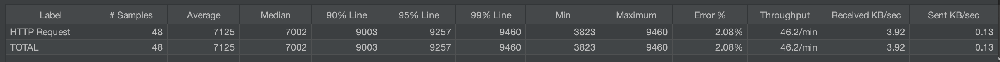
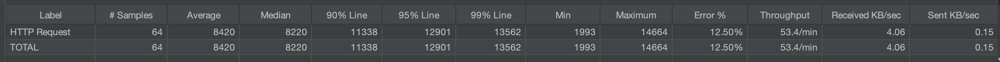
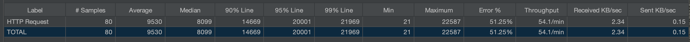

# Music Service

## How to Run

I've already uploaded a Docker image for this app. To pull it from Docker Hub,
run the following command:
```shell
cd src/main/docker

docker-compose up
```

or alternatively 

```shell
docker run -p 8080:8080 docker.io/luckysahaf/music-service:latest
```

## How to Build

```shell
mvn clean install
```

### Running without docker
```shell
mvn spring-boot:run -Dspring.config.location=./applicaton.yml
```

### Building Docker Image Locally

After you've built the app jar, you can run the following commands:

```shell
cd src/main/docker

./build.sh

docker-compose up
```


## Sample Requests

- http://localhost:8080/musify/music-artist/details/cc197bad-dc9c-440d-a5b5-d52ba2e14234
- http://localhost:8080/musify/music-artist/details/83d91898-7763-47d7-b03b-b92132375c47
- http://localhost:8080/musify/music-artist/details/f90e8b26-9e52-4669-a5c9-e28529c47894
- http://localhost:8080/musify/music-artist/details/53b106e7-0cc6-42cc-ac95-ed8d30a3a98e
- http://localhost:8080/musify/music-artist/details/86437518-fca1-4117-b698-b371b72d76a5


## About the Solution

### Technical Stack

- Java 17
- Spring Boot (WebFlux / Reactive / Aspect)
- [Resilience4j](https://resilience4j.readme.io)


### Design and Implementation

Since the service is gathering data from a bunch of other external services,
it is natural to choose a non-blocking architecture for this API. I have chosen
WebFlux/Reactive to achieve this. An imperative approach would have resulted in latencies 
in minutes, rendering it unusable with even 1 request per second. Moreover, since
it's not CPU intensive, we don't want to waste cores by using a huge pool of threads.

To avoid piling a big load of requests, I have used COUNT_BASED CircuitBreaker pattern
for incoming requests. If number of errors from downstream services reaches a certain
threshold, the CircuitBreaker *opens* up and doesn't allow any further requests to be made.
This allows the server to *cool down*, giving it some time to get rid of backlog.
CircuitBreaker is configured to look for certain exceptions only. There is a Time-Limiter
attached to CircuitBreaker as well to make sure that the event publisher doesn't remain
idle for too long and fail in good time to lay off some load.

The rate limit for MusicBrainz API was too low (1 req/sec). So, I decided to add a 
rate-limiter to outgoing requests to the said API. This also allows to not send requests
to MusicBrainz at a rate that we know will definitely fail. This rate-limit can be configured
if we are allowed higher rate.

I have used Resilience4j to cater these resilience requirements for the app. It is a
lightweight library to achieve resiliency, and I find it easy to configure.


#### Stuff Left
I did ample error handling, however, I also left some errors not handled because 
I wanted to focus on implementing resiliency.

I tested the CircuitBreaker and other resiliency limiters with JMeter. I haven't
added any logs for that, however, I am attaching some screenshots.


##### Rate: 6 req / sec


Error Rate: 2%

OKs: 46/48

##### Rate: 8 req / sec



Error Rate: 12.5%

OKs: 56/80

##### Rate: 10 req / sec

Error Rate: 71.25%

OKs: 23/80



#### What could be done differently or additionally?

If you look into the configuration file [application.yml](./application.yml), there are 
too many configurations attached to the resilience4j. I would prefer to calculate them
given limited number of parameters like rate-limits of downstream APIs, etc.

I would also have used TIME_BASED CircuitBreaker. It would allow dynamic rate calculation
rather than having a fixed rate for downstream APIs. MusicBrainz, for instance, may allow 50
requests/second. But it could become slower for some time and time based CircuitBreaker
would change its *allowed rate* according to changes in error rates.

Although, I have partially configured to post health metrics for CircuitBreaker, they 
are not available on the /actuator endpoint. These metrics can be used to launch more
instances of the app inside a cluster, so the load could be divided.

Another thing that I haven't implemented is caching, which would dramatically improve 
the latency of repeating requests. I'd have done it with a distributed cache like Redis so
the app remains scalable.


#### Shortcuts
I did some hard-coded configurations when creating clients in 
[PlubWebClients](./src/main/java/com/plugsurfing/musicservice/PlugWebClients.java), mainly
due to lack of time and also because I was changing them here and there.